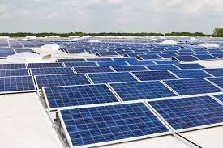

### Week 2

#### Potential Projects:
Eco-Bikes: Use regenerative braking, but might not be very efficient. Use solar panels to charge phone, from the bike. 

Solar panel hat. A hat will have solar panels on it to collect energy to charge the phone. However, might be clunky to use. 

There are methods to capture water from the air. This could be used in Saudi Arabia and other countries where water is more scarce. 

Solar powered public infrastructure, including vending machines, water fountains, ATMs etc.

Compost heat generators

Using sewer flow or trash from public bins or algae → hydroelectric and biofuel: https://www.sciencedirect.com/science/article/pii/S2095809917300875

Outdoor pavilion powered by solar energy that delivers energy to create hot water. This could be used for coffee, tea, etc. 

Solar panel picture:

#### Note Taking
Possible Clients/Audience:
- Residential Building
- Small Business
- Government(local/national)
- Non-profits
- MIT students, instructors, visitors
- Campers
- Outdoor Activities/Sailing
- Those with housing displaced
- Students on campus
- Cambridge residents

Possible Energy Sources:
- Solar
- Wind
- Hydro
- Rain
- Geothermal
- Compost
- Kinetic

Energy Capture/Storage:
- DC voltage
- Battery
- Compressed air (Underwheel)
- Water wheel
- Tidal energy
- Phase change 
- Tanks of water (Water tower)

Waste/Heat:
- Embodied energy/inefficiency
- Braking/stopping/flywheel
- Evaporative cooling

Project Brainstorming:
- Rechargeable Hand Warmers
- Cabin heated by compost
- Wheel/rain capture
  - Runoff capture
  - Charges phone/umbrella
- Solar concetrator pavilion
  - cook food
- Science Demo
  - Didactic Sculpture
- Boiling water pavilion (purifying)
- Perpetual motion

