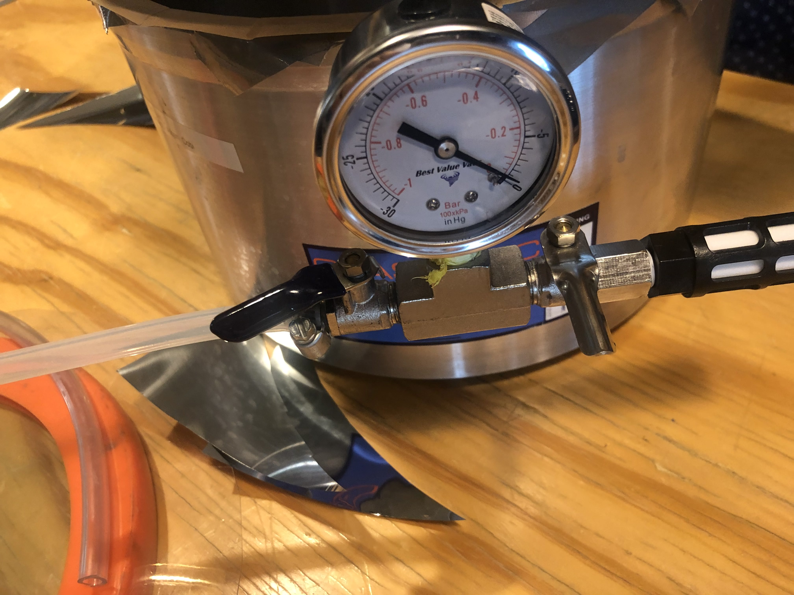
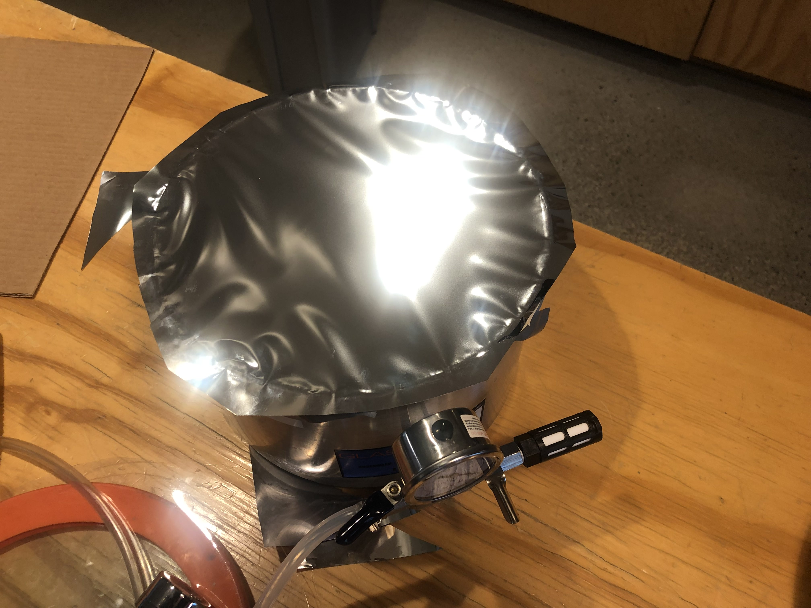
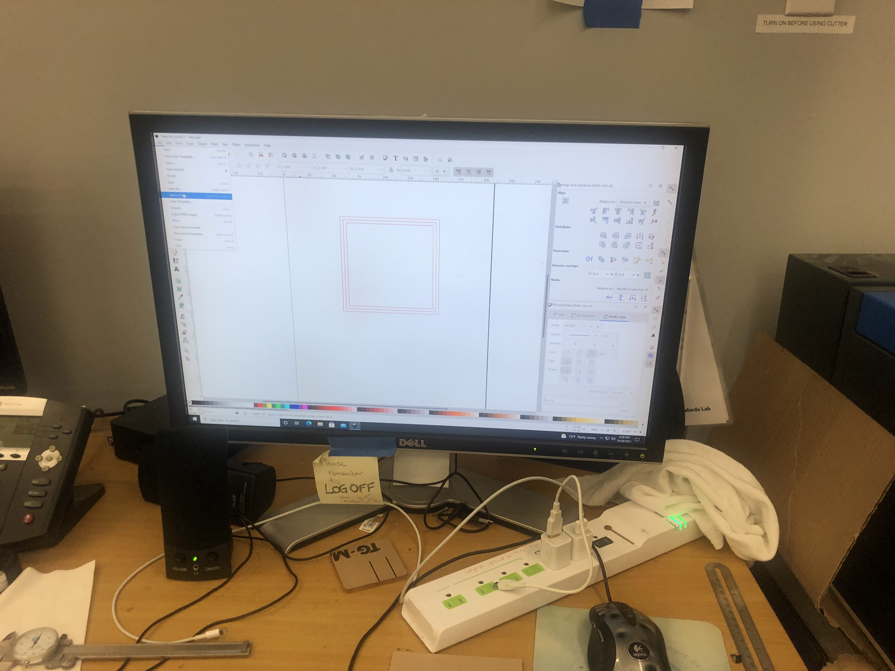
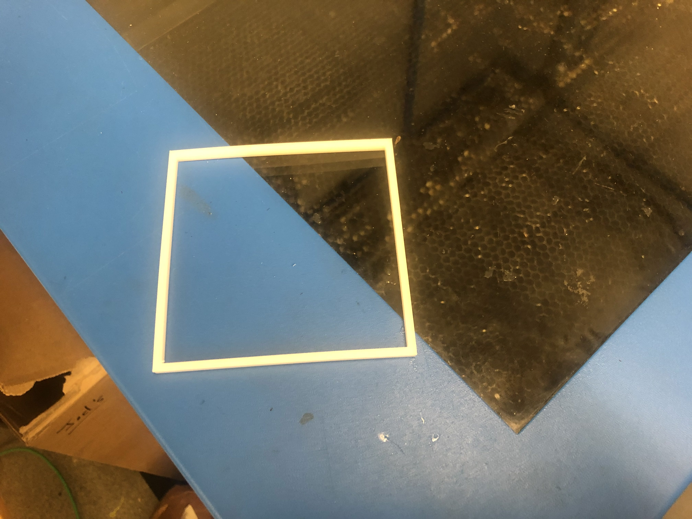
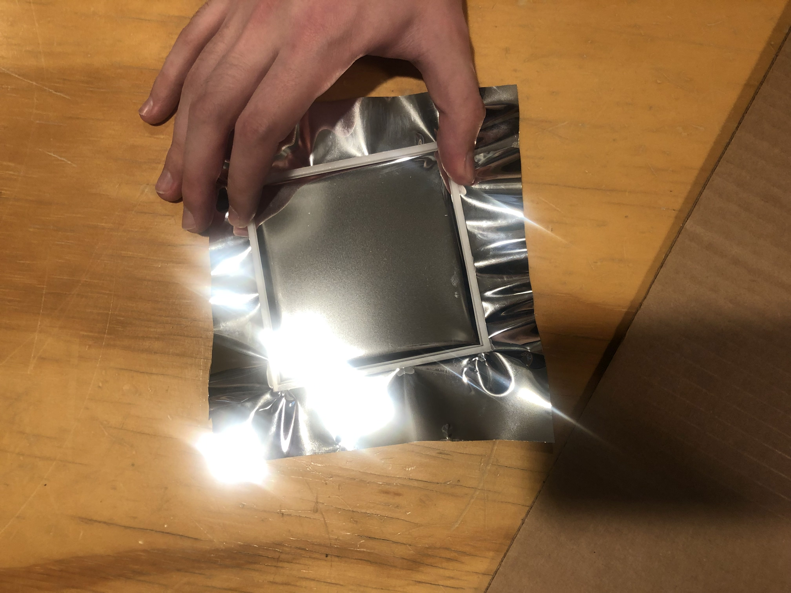

# Week 6

## [Home](https://dtxiong.github.io/rapid-prototyping/)

This week, as part of the energy capture team, we started making some prototypes. 

We first tried using Mylar to create a parabolic mirror. We stretched the mylar over the vacuum pot, and used a pump to remove the air from the pot. Though we tried multiple times, we could not get the Mylar to be sealed completely. In addition, when the vacuum was introduced the Mylar would produce waves along the edges due to stretching. 

