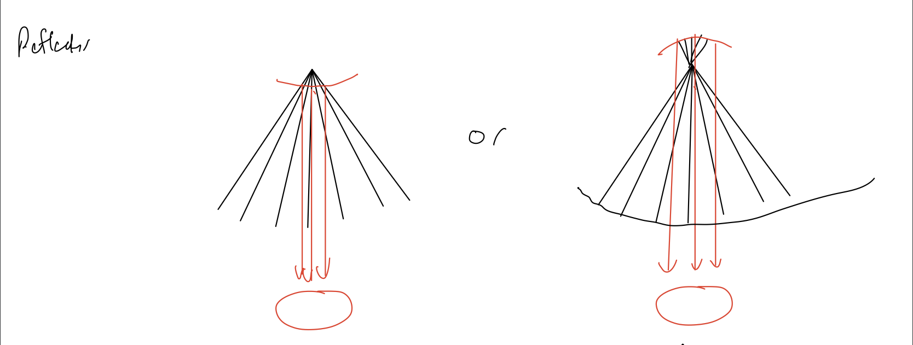

# Week 7

## [Home](https://dtxiong.github.io/rapid-prototyping/)

This week, as part of the energy capture team, we continued working on the design of the solar collector. 

### Primary Reflector

Last week, we explored the idea of using square shaped mirror components, to form the parabola we need. However, squares do not fit well together to form a curved surface. For this reason, we can look at larger components for our mirror. In the picture below, we have two different configurations. One way is to form concentric rings, shown on the top right. These rings can be angled to form a rough parabola. The second configuration is to seperate the mirror radially. Many of these curved triangular sections can be placed together to form the parabola. 

These configurations will be easier to put together, as there are less individual parts. In addition, because we only have 1 degree of rotation in our components, it's possible to still spread the mylar flat. However, it will be harder to manufacture since we must curve the structural pieces after laser cutting them, possibly by heating. Getting the right curvature will be difficult. 

### Secondary Reflector

The secondary reflector will have to also be a parabolic mirror. As shown in the picture below, there will be two possible configurations to make the rays go back vertical. One is to have the vertex above the focal point and have the mirror be concave downward. The other way is to have the vertex below the focal point, and have a concave mirror. Either way, in order for the light rays to be redirected vertical, the focal points of the two reflectors must be the same. This means the secondary reflector, which is smaller in size, will be more curved. This makes it more difficult to manufacture. We are in the process of searching for potential mirrors online, but none so far have small radius and small focal length. In addition, because all rays go vertical, the size of the secondary reflector must be the same as the hole in the primary reflector. If instead we want the rays to be focused on a point below the primary reflector, the secondary reflector must be even more curved. 

We are currently also working on a powerpoint presentation for our midterm review. 

