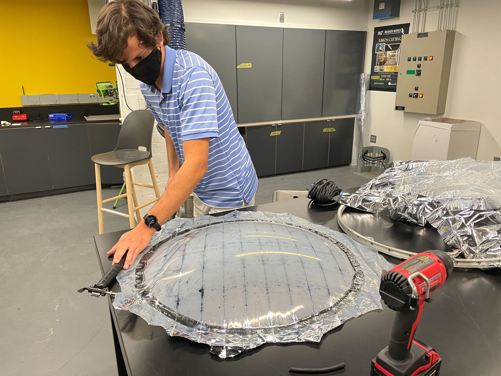

# Week 9

## [Home](https://dtxiong.github.io/rapid-prototyping/)

This week, I was away at a physics conference, so wasn't able to work with the team on the Energy capture system. However, the rest of the team did further work on prototyping the reflector. 

They started on creating the fiberglass layup for the mirror. First, they adhered a mylar sheet onto a metal ring. Then, a pressure was introduced under the ring, so that the mylar protrudes in a parabolic fashion. Then, a fiberglass composite is placed over the mylar sheet, so that it will stay in the parabolic shape. 

Below you can see Pablo working on the fiberglass. At this point, the surface is hardened. 

The next step is to test this with sunlight, or a flashlight to see if the mirror is good enough to provide significant power at the focus. 
